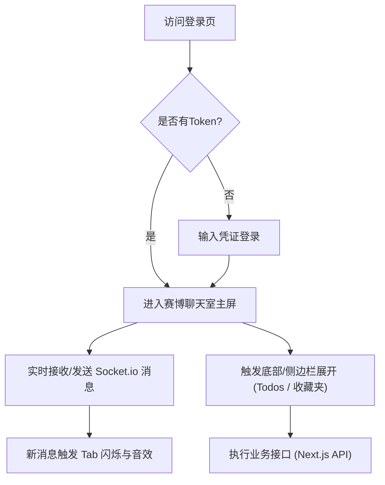

## 1. 产品概述
打造一款具有**赛博朋克/未来科技感 (Cyber-Tech / Sci-Fi)** 的全栈内网聊天室，将原有的朴素界面重构为极具视觉冲击力的现代化应用。
- 采用深色模式主导，结合高对比度荧光色（如霓虹蓝、赛博紫、极客绿）。
- 强调极简与硬核并存的“黑客帝国”风格，提供流畅的交互动效、玻璃拟态（Glassmorphism）、毛玻璃材质及科技感的发光边框。
- 保留原有核心功能：实时群聊、文件/图片收发、Markdown 附件预览、多态任务板（Todos）、个人合集收藏夹（Favorites）、系统主动消息提醒。

## 2. 核心功能

### 2.1 用户角色
| 角色 | 注册方式 | 核心权限 |
|------|----------|----------|
| 管理员 (Admin) | 系统预置 / 内部指派 | 聊天、任务管理、全员消息强制删除、清空全部收藏夹、用户账号管理 |
| 普通用户 (User) | 管理员创建 | 聊天、分配/完成任务、单条/多条合集收藏 |

### 2.2 功能模块
1. **认证模块 (Auth)**: 极简科幻风格登录页。
2. **主聊天区 (Chat)**: 左侧大屏显示，支持文字、系统自带贴纸、图片与文件附件的发送及预览。
3. **扩展面板 (Sidebar)**: 包含 Todos（任务黑板）与 Favorites（精华收藏库）的侧边滑出或悬浮面板。
4. **通知系统 (Notification)**: 浏览器标签页闪烁、自定义科技感音效提醒。

### 2.3 页面详情
| 页面名称 | 模块名称 | 功能描述 |
|----------|----------|----------|
| 登录页   | 身份验证 | 极具深邃科技感的表单，霓虹按钮，毛玻璃背景。支持账号密码输入。 |
| 聊天主页 | 导航栏   | 显示当前房间状态、在线人数、退出按钮，以及“任务板”和“收藏夹”的呼出开关。 |
| 聊天主页 | 消息流   | 用户头像、科技感气泡框、Markdown 渲染、图片放大预览。支持勾选多条消息进行收藏。 |
| 聊天主页 | 输入区   | 发光边框文本框，附件上传按钮（带有科幻扫描动效），发送按钮。 |
| 扩展抽屉 | 任务黑板 | 列表展示 Todos，支持勾选完成、新建任务。科技风格的进度条。 |
| 扩展抽屉 | 收藏夹   | 单条收藏与合集（Collection）的瀑布流展示，支持导出为 Markdown 文件。 |

## 3. 核心流程
用户登录后进入科技风座舱（主聊天室），实时收发消息并处理任务。

## 4. 用户界面设计 (科技感/赛博风格)
### 4.1 设计风格
- **主色调 (Colors)**: 深邃黑 (`#0B0C10`), 太空灰 (`#1F2833`), 赛博青 (`#66FCF1`), 霓虹蓝 (`#45A29E`) 作为高亮点缀。
- **排版 (Typography)**: 使用 `JetBrains Mono`, `Fira Code` 或 `Space Grotesk` 等极客/等宽字体，数字与代码块具有强烈的程序员风格。
- **材质与动效 (Materials & Motion)**:
  - 玻璃拟态 (Glassmorphism)：半透明背景 + 强烈的背景模糊 (Backdrop-blur)。
  - 发光边框 (Glow Effects)：输入框聚焦或新消息到达时，周围带有赛博青的霓虹发光晕影 (Box-shadow)。
  - 扫描线与噪点 (Scanlines & Grain)：页面底层可加入极其轻微的网格背景或 CRT 噪点纹理，提升 Sci-Fi 质感。
- **布局 (Layout)**: 模块化 HUD（平视显示器）风格，各面板具有清晰的切割感与硬朗的直角/极小圆角边框。

### 4.2 页面设计概览
| 页面名称 | 模块名称 | UI 元素风格 |
|----------|----------|-------------|
| 登录页   | 认证表单 | 全屏暗黑噪点背景，中央悬浮发光卡片，输入框底部荧光线条，提交按钮带有数据加载动画。 |
| 聊天主页 | 消息面板 | 滚动区使用隐藏式科技感滚动条。对方消息使用深灰气泡，己方消息使用带有赛博青边框的半透明气泡。 |
| 侧边栏   | Todos    | 滑出时带有干脆利落的机械音（如果可行）或平滑的弹簧动画，Checkbox 使用发光的方形框。 |

### 4.3 响应式策略
- **桌面端优先 (Desktop First)**: 呈现完美的 HUD 操控台布局，左侧聊天主视觉，右侧固定或可折叠侧边栏。
- **移动端适配**: 聊天室全屏化，所有扩展功能（任务、收藏）全部收纳于底部汉堡菜单或抽屉中，保证聊天核心体验。