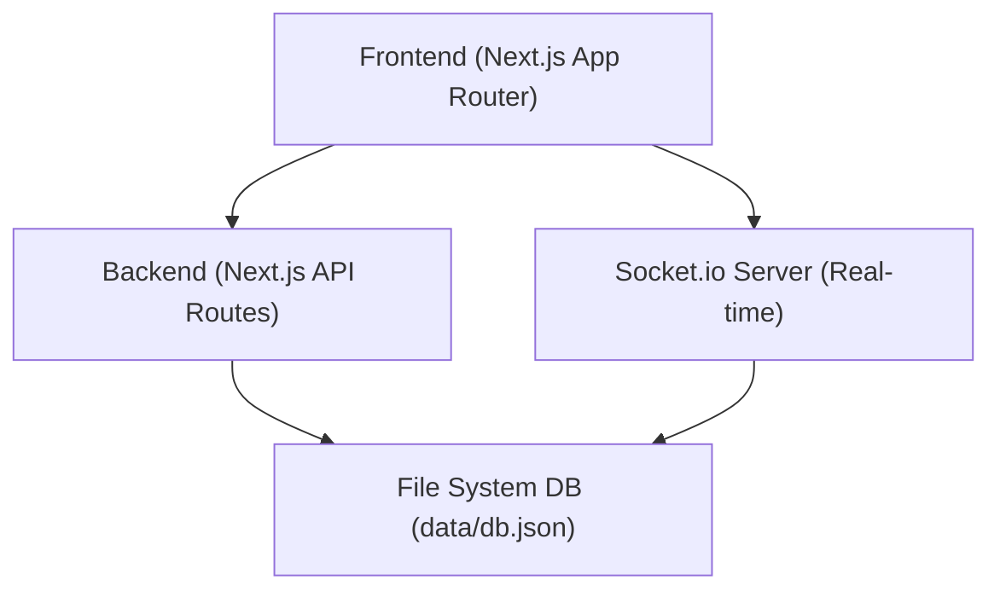
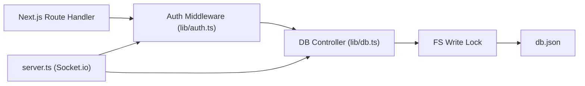
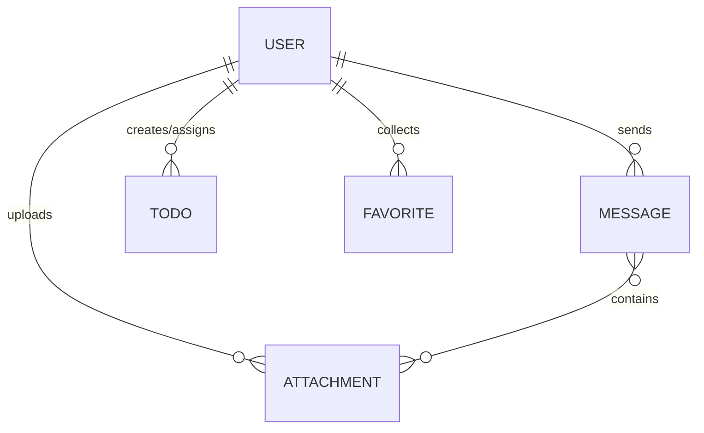

## 1. 架构设计
基于全栈 TypeScript 的 Monorepo 架构，集成 Next.js App Router 与自定义的 Node.js Socket.io Server，并使用 TailwindCSS 处理赛博/科技风样式。

## 2. 技术描述
- Frontend: `React 19` + `Next.js 15` (App Router) + `TailwindCSS 4` + `framer-motion` (科技感动效)
- Backend: `Next.js Route Handlers` + `fs/promises`
- Real-time: `socket.io` + `socket.io-client`
- Auth: `jsonwebtoken` + `bcryptjs`
- Initialization: 已在当前分支通过 `create-next-app` 及自定义 `server.ts` 初始化完毕。

## 3. 路由定义
| 路由 | 用途 |
|------|---------|
| `/` | 聊天室主屏 (要求鉴权) |
| `/login` | 极客风登录页 |

## 4. API 定义
已在前置阶段（阶段二、阶段三）完成 `src/types/index.ts` 契约及 `src/app/api/...` 的接口开发。
核心类型: `User`, `ChatMessage`, `Todo`, `Favorite`, `ServerToClientEvents`, `ClientToServerEvents`。

## 5. 服务端架构

## 6. 数据模型
### 6.1 数据模型定义

### 6.2 数据结构定义
(已映射为 JSON 文件，无需 DDL)
- **Users**: id, username, passwordHash, role, createdAt
- **Messages**: id, room, userId, username, text, sticker, attachments, createdAt
- **Attachments**: id, originalName, storedName, mime, size, uploaderId, createdAt
- **Todos**: id, content, completed, creatorId, assigneeId, createdAt, completedAt
- **Favorites**: id, userId, type ('single'|'collection'), message|messages, title, createdAt